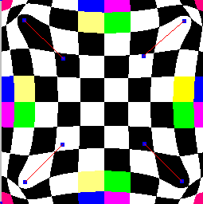

record some project 

## from [UCTC_CG](https://github.com/Ubpa/USTC_CG)

### minidraw

### imagewarping

IDW

RBF

bug images :)

## from [Tinyrender](https://github.com/ssloy/tinyrenderer/wiki)

### tinyrender

